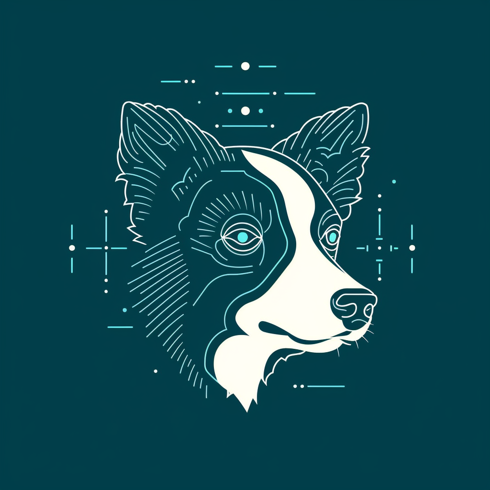

# Collie
|  | Collie Herding Sheep, Collie Finetune LLaMa. 🐕 🌿 🐑, 🐕‍🦺 🛠️ 🦙 |
| ------------------------------------------------------------ | ---------------------------------------------------- |


## Getting started

### install dependencies
```bash
pip install -r requirements.txt
# if dev
pip install -r dev-requirements.txt
```

### prepare data

- jsonl format
```json
{"instruction": "<instruction text>", "output": "<output text>"}
{"instruction": "<instruction text>", "output": "<output text>"}
{"instruction": "<instruction text>", "output": "<output text>"}
```

also support csv format

### single gpu finetune

```bash
# get help
python finetune.py --help
# run finetune
# eg: python fineune.py BelleGroup/BELLE-7B-2M data.jsonl
python finetune.py <model_name_or_path> <data_file>
```

### multi-gpu finetune
1. create config file
```bash
accelerate config --config_file <config_file>
```
2. run finetune script
```bash
accelerate launch --config_file <config_file> finetune.py <model_path> <data_file>
```

## Dev

```bash
# run test case
make test
# check code style & lint code
make lint
```

## TODO
- [ ] github action
- [ ] chat format data
- [ ] instrucion testing
- [ ] lora finetune
